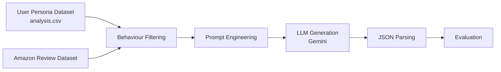
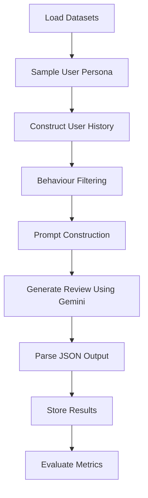
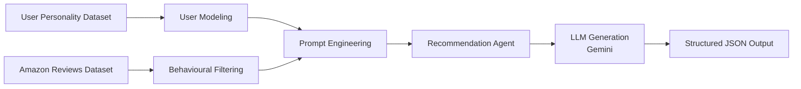
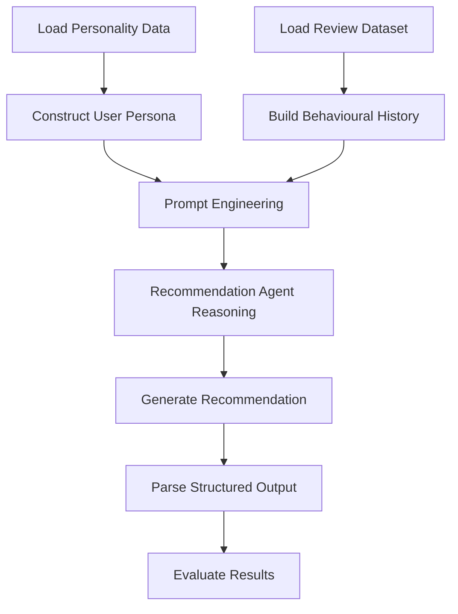

# PROJECT HITORI — LLM AGENT CHALLENGE

> Personality-Aware AI Agents for User Modeling and Recommendation Systems


---

# Overview

Project Hitori is a dual-agent AI research project developed for the **DSN x BCT LLM Agent Challenge 2026**.

This repository contains **two separate but related AI systems**:

| Task | Folder | Description |
|---|---|---|
| **Task A — User Modeling Agent** | `usermodeling_agent/` | Simulates realistic user behavior and synthetic product reviews using personality-aware prompting |
| **Task B — Recommendation Agent** | `recommendation_agent/` | Builds a contextual recommendation system capable of conversational and personalized retrieval |

The project explores how Large Language Models (LLMs) can move beyond traditional collaborative filtering into:

- personality-aware reasoning
- contextual recommendation
- behavioral simulation
- synthetic review generation
- controllable user modeling

---

# Repository Structure

```bash
LLM_Agent_Challenge/
│
recommendation_agent/
├── helpers/
│   ├── __pycache__/
│   ├── config.py
│   ├── generator.py
│   ├── json_utils.py
│   ├── memory.py
│   ├── planner.py
│   ├── reranker.py
│   └── retrieval.py
│
├── venv/
├── .env
├── app.py
├── main.ipynb
└── requirements.txt
│
usermodeling_agent/
├── Evaluation/
│   └── results.ipynb
│
├── data/
│   ├── processed/
│   └── item_fetcher.py
│
├── datasets/
│   └── analysis.csv
│
├── helpers/
│   ├── __pycache__/
│   ├── config.py
│   ├── data_loader.py
│   ├── generator.py
│   ├── parser.py
│   ├── prompt_builder.py
│   └── user_utils.py
│
├── models/
│   ├── __pycache__/
│   ├── feature_engineering.py
│   └── user_profiles.py
│
├── prediction/
│   ├── __pycache__/
│   └── llm_simulator.py
│
├── venv/
├── .env
├── app.py
├── main.ipynb
└── requirements.txt
│
└── README.md
```

---

# TASK A — USER MODELING AGENT

## Overview

The **User Modeling Agent** focuses on simulating realistic human behavior using personality-aware generative AI.

The system generates:

- synthetic product reviews
- star ratings
- writing styles
- sentiment patterns

conditioned on:

- personality traits
- historical review behavior
- contextual product information

The objective is to investigate whether LLMs can reproduce nuanced human-like behavior through structured prompting.

---

# Task A Architecture



---

# What This Diagram Represents

This architecture describes the complete synthetic user simulation pipeline used in the User Modeling Agent.

---

## 1. User Persona Dataset

Contains structured personality features such as:

- openness
- agreeableness
- verbosity
- sentiment tendencies
- writing style indicators

These traits define the simulated user identity.

---

## 2. Amazon Review Dataset

Used to provide:

- real-world writing patterns
- historical behavioral examples
- contextual grounding
- review realism

---

## 3. Behaviour Filtering

The system filters historical reviews based on:

- sentiment similarity
- writing style alignment
- verbosity
- category relevance

This creates a pseudo-history for the synthetic user.

---

## 4. Prompt Engineering

Structured prompts combine:

- personality traits
- review history
- product context
- behavioral constraints

This stage controls how the LLM behaves.

---

## 5. LLM Generation

Gemini generates:

- a star rating
- a natural language review

conditioned on the structured persona prompt.

---

## 6. JSON Parsing

Generated outputs are converted into structured JSON for:

- storage
- evaluation
- downstream analysis

---

## 7. Evaluation

Outputs are evaluated using:

- Rating Accuracy
- Review Quality
- Behavioural Fidelity

---

# User Modeling Pipeline



---

# What This Pipeline Represents

This pipeline shows the sequential workflow used to generate synthetic user reviews.

The process begins with dataset loading and persona sampling, then proceeds through behavioral filtering and prompt construction before the Gemini LLM generates reviews and ratings.

The final stage evaluates how realistic and behaviorally consistent the generated outputs are.

---

# Key Features — User Modeling Agent

- Personality-aware user simulation
- Synthetic review generation
- Contextual prompting
- Behavioral conditioning
- Structured JSON outputs
- Modular architecture
- LLM-powered persona simulation

---

# TASK B — RECOMMENDATION AGENT

## Overview

The **Recommendation Agent** focuses on building a contextual recommendation system capable of conversational and personalized retrieval.

Unlike traditional recommender systems, the agent incorporates:

- user personality
- conversational context
- behavioral history
- product semantics
- contextual grounding

to produce more believable recommendations.

The goal is to move beyond collaborative filtering into reasoning-driven recommendation generation.

---

# Task B Architecture



---

# What This Diagram Represents

This architecture illustrates how the Recommendation Agent integrates personality modeling and contextual retrieval into recommendation reasoning.

---

## 1. User Modeling

The system constructs synthetic user personas using:

- personality traits
- writing behavior
- preference tendencies

This improves personalization.

---

## 2. Behavioural Filtering

Historical reviews are filtered to align with:

- tone
- sentiment
- verbosity
- product category relevance

This creates realistic behavioral memory.

---

## 3. Prompt Engineering

The prompt includes:

- personality summaries
- review history
- recommendation context
- conversational instructions

This allows controllable recommendation generation.

---

## 4. Recommendation Agent

Acts as the reasoning layer responsible for:

- contextual retrieval
- user preference simulation
- recommendation generation
- conversational interaction

---

## 5. LLM Generation

Gemini generates:

- personalized recommendations
- natural language responses
- contextual explanations

---

## 6. Structured Output

Outputs are converted into structured JSON for consistency and evaluation.

---

# Recommendation Agent Pipeline



---

# What This Pipeline Represents

This pipeline demonstrates how the Recommendation Agent processes personality data and behavioral context to generate personalized recommendations.

The workflow emphasizes:

- contextual reasoning
- user simulation
- conversational recommendation generation
- structured evaluation

---

# Key Features — Recommendation Agent

- Contextual recommendation generation
- Conversational retrieval
- Personality-aware reasoning
- Prompt-based recommendation
- User simulation
- Structured recommendation outputs
- LLM-powered recommendation logic

---

# Datasets

## 1. User Personality Dataset (`analysis.csv`)

Contains:

- behavioral indicators
- personality traits
- writing style tendencies
- latent preference signals

Used for synthetic persona generation.

---

## 2. Amazon Review Dataset

Used for:

- historical review simulation
- writing style alignment
- contextual grounding
- behavioral filtering

---

# Technologies Used

| Technology | Purpose |
|---|---|
| Python | Core development |
| Gemini LLM | Text generation |
| Pandas | Data processing |
| NumPy | Numerical operations |
| Scikit-learn | Evaluation utilities |
| Prompt Engineering | Behavioral conditioning |

---

# Evaluation Metrics

## Rating Accuracy

Measures how realistic generated ratings are.

---

## Review Quality

Measures:

- fluency
- coherence
- readability
- contextual relevance

---

## Behavioural Fidelity

Measures how well generated outputs align with expected user behavior.

---

# Results Summary

| Metric | Observation |
|---|---|
| Average Rating | 4.2 / 5 |
| Review Quality | Moderate realism |
| Behavioural Fidelity | Weak alignment |
| Persona Consistency | Partial |
| Contextual Relevance | Strong |

---

# Key Findings

## Strengths

- Coherent review generation
- Strong contextual grounding
- Modular architecture
- Effective prompt conditioning
- Flexible recommendation pipeline

---

## Limitations

- Positive rating bias
- Weak persona consistency
- Limited behavioral realism
- Over-reliance on product context
- Difficulty maintaining long-term behavioral fidelity

---

# Installation

```bash
git clone https://github.com/monsterdevgit/LLM_Agent_Challenge.git

cd LLM_Agent_Challenge
```

---

# Install Dependencies

## User Modeling Agent

```bash
cd usermodeling_agent

pip install -r requirements.txt
```

---

## Recommendation Agent

```bash
cd recommendation_agent

pip install -r requirements.txt
```

---

# Running the Applications

## User Modeling Agent

```bash
streamlit run app.py
```

---

## Recommendation Agent

```bash
streamlit run app.py
```

---

# Example Output

```json
{
  "Review": "I really enjoyed using this product. The design feels premium and the performance exceeded my expectations.",
  "Score": 5
}
```

---

# Future Improvements

Planned enhancements include:

- Reinforcement Learning from Human Feedback (RLHF)
- Embedding-based behavioral retrieval
- Multi-turn conversational agents
- Persona calibration
- Fine-tuning vs prompting comparison
- Bias correction mechanisms
- Improved behavioral fidelity metrics

---

# Research Contributions

This project contributes to research in:

- LLM-powered recommendation systems
- Generative user simulation
- Personality-aware AI systems
- Prompt-conditioned behavioral modeling
- Synthetic review generation
- Conversational recommendation agents

---

# Author

## Kenneth Essien

Project submitted for:

**DSN x BCT LLM Agent Challenge 2026**

Project Name:

# PROJECT HITORI

> “Hitori” (一人) translates to “one person” in Japanese — reflecting the idea of modeling an individual user's behavior, reasoning, and preferences through AI.

---
